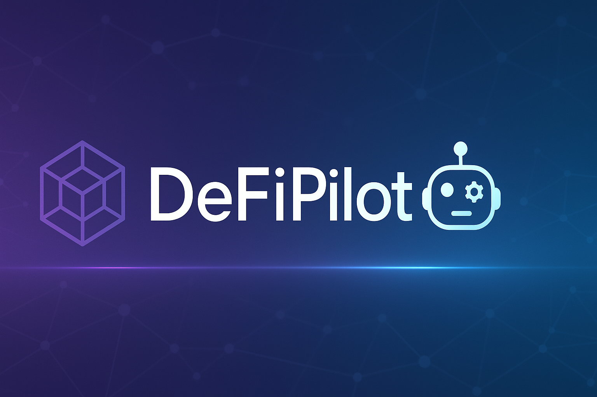
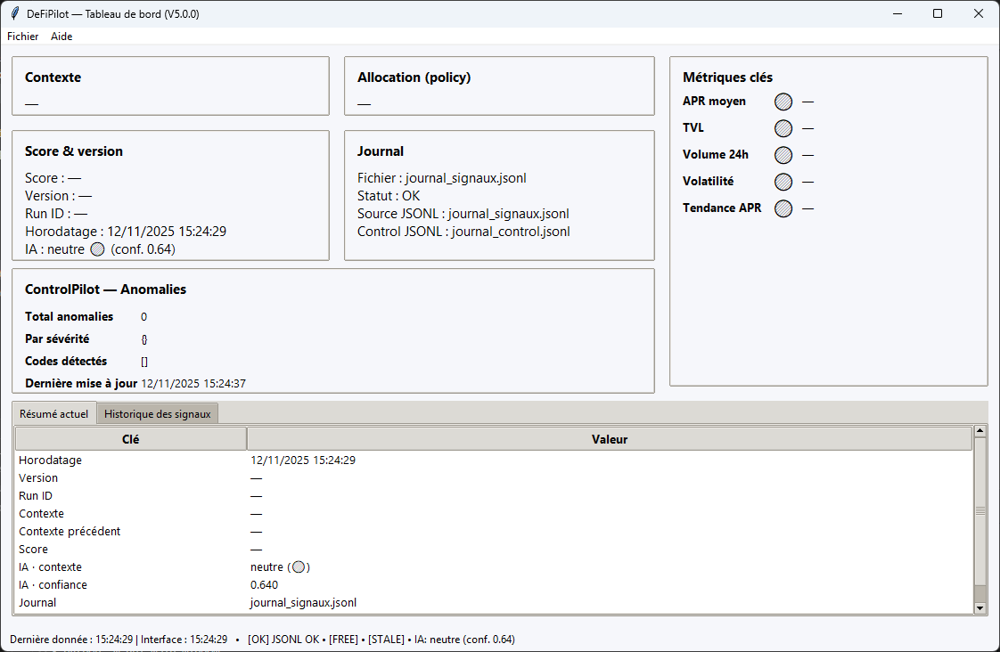

> 🗣️ **Langue / Language :** le bot fonctionne uniquement en **français** pour le moment.  
> The bot currently works **in French only** for the moment.


---

## 📚 Sommaire / Table of Contents
1. [Introduction / Introduction](#1-introduction--introduction)  
2. [Fonctionnalités principales / Key Features](#2-fonctionnalites-principales--key-features)  
3. [Aperçu visuel / Visual Overview](#3-apercu-visuel--visual-overview)  
4. [Nouveautés / What's New — Version 5.2](#4-nouveautes--whats-new--version-52)  
5. [Historique des versions / Past Versions](#5-historique-des-versions--past-versions)  
6. [Caractéristiques techniques / Technical Highlights](#6-caracteristiques-techniques--technical-highlights)  
7. [Prérequis / Requirements](#7-prerequis--requirements)  
8. [Installation / Installation](#8-installation--installation)  
9. [Utilisation / Usage](#9-utilisation--usage)  
10. [Feuille de route / Roadmap](#10-feuille-de-route--roadmap)  
11. [Vision du projet / Project Vision](#11-vision-du-projet--project-vision)  
12. [FAQ / Foire aux questions](#12-faq--foire-aux-questions)  
13. [À propos de l’auteur / About the Author](#13-a-propos-de-lauteur--about-the-author)  
14. [Crédits techniques / Technical Credits](#14-credits-techniques--technical-credits)  
15. [Licence / License](#15-licence--license)  
16. [Dernière révision / Last Review](#16-derniere-revision--last-review)


---

# 1. 🧭 Introduction / Introduction

## FR
DeFiPilot est un bot DeFi autonome conçu pour analyser en continu les opportunités disponibles sur les échanges décentralisés (DEX), calculer la rentabilité réelle des pools, puis sélectionner les meilleures options en fonction d’un profil d’investissement configurable. Le système fonctionne aussi bien en mode simulation qu’en mode réel selon la configuration utilisateur.

Son architecture repose sur quatre principes :  
- **Robustesse** : tolérance aux erreurs réseau, redondances, vérifications multiples.  
- **Modularité** : possibilité d’étendre facilement les fonctionnalités via modules.  
- **Transparence** : journalisation complète (CSV + JSONL), état sauvegardé, historique visible.  
- **Automatisation** : analyse continue, décisions guidées par les profils, reprise automatique.

DeFiPilot vise à constituer une base sérieuse et pérenne pour gérer des investissements DeFi automatisés, tout en intégrant des mécanismes de sécurité pour réduire les risques opérationnels.

## EN
DeFiPilot is an autonomous DeFi bot designed to continuously analyze opportunities across decentralized exchanges (DEX), compute real profitability for liquidity pools, and select the best options according to a configurable investment profile. The system runs in both simulation and real execution modes depending on user configuration.

Its architecture relies on four core principles:  
- **Robustness**: tolerance to network failures, redundancy, multiple safety checks.  
- **Modularity**: easily extendable through additional modules.  
- **Transparency**: full logging (CSV + JSONL), state storage, visible history.  
- **Automation**: continuous analysis, profile‑driven decisions, automatic state recovery.

DeFiPilot aims to be a serious and sustainable foundation for automated DeFi investment management while embedding safety mechanisms to minimize operational risks.

---

# 2. ⚙️ Fonctionnalités principales / Key Features

## FR
- Analyse automatique des pools (APR, TVL, volume, volatilité, slippage).  
- Scoring pondéré basé sur plusieurs profils (Prudent, Modéré, Risque).  
- Mode simulation complet pour tests sécurisés.  
- Mode réel avec gestion du slippage, limites, confirmations.  
- Interface graphique Tkinter avec rafraîchissement automatique.  
- Multi-wallets avec séparation des usages.  
- Supervision IA via ControlPilot (signaux contextuels).  
- Reprise automatique après coupure (fichier `.state`).  
- Journalisation détaillée (JSONL + CSV).  
- Architecture modulaire extensible.

## EN
- Automatic pool analysis (APR, TVL, volume, volatility, slippage).  
- Weighted scoring based on multiple profiles (Conservative, Moderate, Risk).  
- Full simulation mode for safe testing.  
- Real mode with slippage management, limits, confirmations.  
- Tkinter GUI with automatic refresh.  
- Multi‑wallet support.  
- AI supervision via ControlPilot (context signals).  
- Automatic resume after shutdown (`.state`).  
- Detailed logging (JSONL + CSV).  
- Modular and extensible architecture.

---

# 3. 🖥️ Aperçu visuel / Visual Overview



## FR
L’interface graphique de DeFiPilot présente les métriques clés, l’état du bot, les signaux AI de ControlPilot, la liste des pools analysées, et les indicateurs de stratégie actifs.

## EN
DeFiPilot’s graphical interface displays key metrics, bot status, ControlPilot AI signals, list of analyzed pools, and active strategy indicators.

---

# 4. 🆕 Nouveautés / What's New — Version 5.2

## FR
- Nouveau **rééquilibrage automatique du portefeuille** basé sur le contexte du marché et les signaux IA (ControlPilot).  
- Ajout du module `core/rebalancing_simulator.py` : simulation propre, détection des écarts, recommandations et plan d’actions.  
- Intégration complète des **signaux pondérés** dans le moteur de rééquilibrage (favorable / neutre / défavorable).  
- Nouveau fichier `rebalancing_snapshot.jsonl` pour tracer toutes les décisions du rééquilibrage.  
- Amélioration du scoring : adaptation dynamique selon le contexte et meilleure pondération par profil (Prudent / Modéré / Risque).  
- Mise à jour de la stratégie pour intégrer le rééquilibrage en continu (simulation + mode réel limité).  
- Stabilisation générale du pipeline décisionnel en préparation de V5.3 (optimisations IA via LabPilot).

## EN
- New **automatic portfolio rebalancing** system driven by market context and AI signals (ControlPilot).  
- Added `core/rebalancing_simulator.py`: clean simulation engine, drift detection, recommendations and action plan generation.  
- Full integration of **weighted contextual signals** into the rebalancing engine (favorable / neutral / unfavorable).  
- New `rebalancing_snapshot.jsonl` to record all rebalancing decisions.  
- Improved scoring: dynamic adjustments based on context and better profile weighting (Conservative / Moderate / Risk).  
- Updated strategy engine to support continuous rebalancing (simulation + limited real mode).  
- Overall stabilization of the decision pipeline in preparation for V5.3 (AI enhancements via LabPilot).


---

# 5. 🕓 Historique des versions / Past Versions

## FR
- **V5.2 :** Rééquilibrage automatique du portefeuille, intégration des signaux pondérés, nouveau snapshot de rééquilibrage, amélioration du scoring et stabilisation du pipeline décisionnel.  
- **V5.1 :** Nouveau moteur de signaux IA, normalisation avancée, scoring dynamique, stratégie enrichie.  
- **V5.0 :** Intégration IA ControlPilot, stabilité renforcée, dashboard optimisé.  
- **V4.9 :** Agrégation avancée des signaux + détection d’anomalies.  
- **V4.8 :** Collecte des signaux simples (début ControlPilot).  
- **V4.7 :** Stabilisation complète du mode réel + reprise automatique.  
- **V4.6 :** Stratégie dynamique avec ajustements automatiques.  
- **V4.5 :** Améliorations GUI + affichage contextuel.  
- **V4.4 :** Lancement global + supervision initiale.  
- **V4.3 :** Simulation LP + journalisation complète.  
- **V4.2 :** Scoring pondéré + gestion des profils.  
- **V4.0 :** Passage au simulateur complet.

## EN
- **V5.2:** Automatic portfolio rebalancing, weighted signals integration, new rebalancing snapshot, improved scoring, and decision-pipeline stabilization.  
- **V5.1:** New AI signal engine, advanced normalization, dynamic scoring, enriched strategy.  
- **V5.0:** AI ControlPilot integration, improved stability, optimized dashboard.  
- **V4.9:** Advanced signal aggregation + anomaly detection.  
- **V4.8:** Simple signal collection (start of ControlPilot).  
- **V4.7:** Full real-mode stabilization + auto-resume.  
- **V4.6:** Dynamic strategy with automatic adjustments.  
- **V4.5:** GUI improvements + contextual display.  
- **V4.4:** Global launch + initial supervision.  
- **V4.3:** LP simulation + detailed logging.  
- **V4.2:** Weighted scoring + profile management.  
- **V4.0:** Full simulation mode.


---

# 6. 🧱 Caractéristiques techniques / Technical Highlights

## FR
DeFiPilot repose sur une architecture modulaire, pensée pour garantir évolutivité et stabilité :

- **`core/`** — Analyse, scoring, stratégie, transactions, gestion des wallets, rééquilibrage (`rebalancing_simulator.py`).  
- **`gui/`** — Interface Tkinter (rafraîchissement, affichage, widgets personnalisés).  
- **`cli/`** — Exécution en mode console, outils rapides, smoke tests.  
- **`control/`** — Module IA ControlPilot (signaux + agrégation).  
- **`config/`** — Paramètres généraux, profils, fichiers JSON de configuration.  
- **`journal/`** — Système de logs (CSV + JSONL), rotation, journaux par modules, snapshots du rééquilibrage (`rebalancing_snapshot.jsonl`).  
- **`state/`** — Gestion du fichier `.state` (reprise automatique).  

Le bot utilise principalement **Python 3.11**, **Web3.py**, **Tkinter**, **Pandas**, et l’API **DefiLlama**.

## EN
DeFiPilot is built on a modular architecture designed for scalability and stability:

- **`core/`** — Analysis, scoring, strategy, transactions, wallet management, rebalancing (`rebalancing_simulator.py`).  
- **`gui/`** — Tkinter interface (refresh engine, display, custom widgets).  
- **`cli/`** — Console execution, quick tools, smoke tests.  
- **`control/`** — ControlPilot AI module (signals + aggregation).  
- **`config/`** — Global settings, profiles, JSON configuration files.  
- **`journal/`** — Log system (CSV + JSONL), rotation, per-module logs, rebalancing snapshots (`rebalancing_snapshot.jsonl`).  
- **`state/`** — `.state` file management (auto-resume).  

The bot relies mainly on **Python 3.11**, **Web3.py**, **Tkinter**, **Pandas**, and the **DefiLlama** API.


---

# 7. 🔧 Prérequis / Requirements

## FR
- Python **3.11+**  
- Accès RPC Polygon (Infura, Alchemy, QuickNode)  
- Wallet compatible (Rabby, MetaMask)  
- Connexion Internet stable  
- Git installé

## EN
- Python **3.11+**  
- Polygon RPC access (Infura, Alchemy, QuickNode)  
- Compatible wallet (Rabby, MetaMask)  
- Stable Internet connection  
- Git installed

---
# 8. ⚙️ Installation / Installation

## FR
1. **Cloner le dépôt :**
```bash
git clone https://github.com/DavidRaffeil/DeFiPilot.git
cd DeFiPilot
```
2. **Créer l’environnement virtuel et installer les dépendances :**
```bash
python3.11 -m venv .venv
source .venv/bin/activate  # Windows : .venv\Scripts\activate
pip install -U pip
pip install -r requirements.txt
```
3. **Configurer le fichier `.env` :**
```dotenv
NETWORK=polygon
RPC_URL=https://polygon-mainnet.infura.io/v3/<PROJECT_ID>
WALLEΤ_ADDRESS=<VOTRE_ADRESSE_WALLET> # remplacer par votre adresse
LOG_LEVEL=INFO

```
4. **Vérifier l’installation :**
```bash
python check_setup.py
```

## EN
1. **Clone the repository:**
```bash
git clone https://github.com/DavidRaffeil/DeFiPilot.git
cd DeFiPilot
```
2. **Create a virtual environment and install dependencies:**
```bash
python3.11 -m venv .venv
source .venv/bin/activate  # Windows: .venv\Scripts\activate
pip install -U pip
pip install -r requirements.txt
```
3. **Configure the `.env` file:**
```dotenv
NETWORK=polygon
RPC_URL=https://polygon-mainnet.infura.io/v3/<PROJECT_ID>
WALLEΤ_ADDRESS=<YOUR_WALLET_ADDRESS> # replace with your address
LOG_LEVEL=INFO

```
4. **Verify installation:**
```bash
python check_setup.py
```

---
# 9. ▶️ Utilisation / Usage

## FR
- **Interface graphique :**
```bash
python start_defipilot.py
```
- **Mode console (headless) :**
```bash
python run_defipilot.py
```
Les journaux sont enregistrés dans `journal_*.jsonl` et `journal_*.csv`.

## EN
- **Graphical interface:**
```bash
python start_defipilot.py
```
- **Headless mode:**
```bash
python run_defipilot.py
```
Logs are saved in `journal_*.jsonl` and `journal_*.csv`.

---
# 10. 🚀 Feuille de route / Roadmap

## FR
- **V5.3 :** Optimisations IA via LabPilot (analyse avancée des signaux, amélioration du moteur décisionnel).  
- **V5.4 :** Version préliminaire d’ArbiPilot (arbitrage inter-DEX).  
- **V6.0 :** Écosystème multi-bots autonome (DeFiPilot + ControlPilot + ArbiPilot + LabPilot).

### Versions finalisées
- **V5.2 :** Rééquilibrage automatique du portefeuille, signaux pondérés, snapshots de rééquilibrage, mise à jour scoring/stratégie.  
- **V5.1 :** Stratégie IA complète (signaux normalisés, scoring dynamique, snapshots).  
- **V5.0 :** Intégration ControlPilot + stabilisation du mode réel.

## EN
- **V5.3:** AI optimizations via LabPilot (advanced signal analysis, improved decision engine).  
- **V5.4:** Preliminary version of ArbiPilot (inter-DEX arbitrage).  
- **V6.0:** Autonomous multi-bot ecosystem (DeFiPilot + ControlPilot + ArbiPilot + LabPilot).

### Completed versions
- **V5.2:** Automatic portfolio rebalancing, weighted signals, rebalancing snapshots, updated scoring/strategy.  
- **V5.1:** Full AI-driven strategy (normalized signals, dynamic scoring, snapshots).  
- **V5.0:** ControlPilot integration + real-mode stabilization.


---
# 11. 🌍 Vision du projet / Project Vision

## FR
DeFiPilot vise à devenir une plateforme de gestion automatisée complète regroupant :  
- Analyse multi‑DEX, multi‑blockchains.  
- Stratégies dynamiques ajustées selon le marché.  
- Modules complémentaires (ControlPilot, ArbiPilot, LabPilot).  
- Architecture transparente et robuste centrée sur la sécurité et la pédagogie.

## EN
DeFiPilot aims to evolve into a complete automated management platform including:  
- Multi‑DEX, multi‑chain analysis.  
- Dynamic strategies adjusted to market conditions.  
- Complementary modules (ControlPilot, ArbiPilot, LabPilot).  
- Transparent and robust architecture focused on safety and clarity.

---
# 12. ❓ FAQ / Foire aux questions

## FR
**1. DeFiPilot effectue‑t‑il des transactions automatiquement ?**  
Oui, si le mode réel est activé et correctement configuré. En mode simulation, aucune transaction blockchain n’est envoyée.

**2. Puis‑je utiliser DeFiPilot sans interface graphique ?**  
Oui, le bot peut fonctionner en mode console (headless) via `run_defipilot.py`.

**3. Quels réseaux sont supportés ?**  
Polygon est supporté en natif. D’autres blockchains seront ajoutées progressivement.

**4. Les clés privées sont‑elles stockées en clair ?**  
Elles sont chargées via `.env` et jamais écrites dans les journaux.

**5. Quelle est la fréquence d’analyse ?**  
Elle dépend de la configuration, généralement quelques secondes.

**6. Comment fonctionne la reprise automatique ?**  
L’état est stocké dans un fichier `.state`, permettant au bot de reprendre après une coupure.

**7. Comment fonctionne la supervision IA ?**  
ControlPilot fournit des signaux contextuels (favorable, neutre, défavorable) influençant la stratégie.

**8. Les données de marché proviennent d’où ?**  
Principalement de DefiLlama et des RPC blockchain.

**9. Puis‑je ajouter mes propres stratégies ?**  
Oui, l’architecture modulaire permet d’étendre facilement les stratégies.

**10. Le projet est‑il open source ?**  
Oui, sous licence CC‑BY‑NC‑SA 4.0.

## EN
**1. Does DeFiPilot perform transactions automatically?**  
Yes, if real mode is enabled and properly configured. In simulation mode, no blockchain transactions are sent.

**2. Can I run DeFiPilot without the GUI?**  
Yes, the bot can run headless using `run_defipilot.py`.

**3. Which networks are supported?**  
Polygon is supported natively; other networks will be added later.

**4. Are private keys stored in plain text?**  
They are loaded via `.env` and never written to logs.

**5. What is the analysis frequency?**  
It depends on configuration, usually a few seconds.

**6. How does auto‑resume work?**  
Bot state is stored in a `.state` file, allowing recovery after a shutdown.

**7. How does AI supervision work?**  
ControlPilot provides contextual signals (favorable, neutral, unfavorable) affecting strategy.

**8. Where does market data come from?**  
Mainly from DefiLlama and blockchain RPC endpoints.

**9. Can I add my own strategies?**  
Yes, the modular architecture supports custom strategy modules.

**10. Is the project open source?**  
Yes, licensed under CC‑BY‑NC‑SA 4.0.

---
# 13. 👤 À propos de l’auteur / About the Author

## FR
DeFiPilot est développé par un passionné d’automatisation, d’analyse de données et de finance décentralisée. Le projet a été conçu pour créer un outil pédagogique, robuste et réellement utilisable au quotidien pour explorer la DeFi de manière encadrée.

## EN
DeFiPilot is developed by an enthusiast of automation, data analysis, and decentralized finance. The project aims to provide an educational, robust and practical tool to explore DeFi safely and efficiently.

---
# 14. 🧩 Crédits techniques / Technical Credits

## FR
- Développement assisté par **ChatGPT**.  
- Icônes, badges et éléments visuels issus de ressources libres.  
- Utilisation de **Web3.py**, **Tkinter**, **Pandas**, **DefiLlama API**.

## EN
- Development assisted by **ChatGPT**.  
- Icons, badges and visuals use open free resources.  
- Built on **Web3.py**, **Tkinter**, **Pandas**, **DefiLlama API**.

---
# 15. 📜 Licence / License

## FR
Ce projet est distribué sous licence **CC‑BY‑NC‑SA 4.0**.  
Vous pouvez utiliser, modifier et partager le code tant que :  
- L’usage n’est **pas commercial**.  
- L’auteur est crédité.  
- Les modifications sont partagées sous la même licence.

## EN
This project is released under **CC‑BY‑NC‑SA 4.0**.  
You may use, modify and share the code provided that:  
- Usage is **non‑commercial**.  
- Proper credit is given.  
- Derivative works remain under the same license.

---

# 16. 🔍 Dernière révision / Last Review

**README V5.2 — mis à jour et consolidé.**

---

© 2023-2025 DeFiPilot — Tous droits réservés.  
Projet distribué sous licence CC-BY-NC-SA 4.0.  
© 2023-2025 DeFiPilot — All rights reserved.  
Project distributed under the CC-BY-NC-SA 4.0 license.
