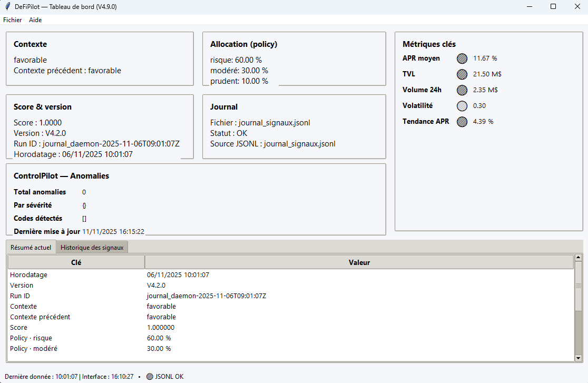

> 🗣️ **Langue / Language :** le bot fonctionne uniquement en **français** pour le moment.  
> The bot currently works **in French only** for the moment.

---

## 📚 Sommaire / Table of Contents

1. [Introduction / Introduction](#-introduction--introduction)  
2. [Fonctionnalités principales / Key Features](#-fonctionnalités-principales--key-features)  
3. [Aperçu visuel / Visual Overview](#-aperçu-visuel--visual-overview)  
4. [Nouveautés / What's New — Version 4.9](#-nouveautés--whats-new--version-49)  
5. [Historique des versions / Past Versions](#-historique-des-versions--past-versions)  
6. [Caractéristiques techniques / Technical Highlights](#-caractéristiques-techniques--technical-highlights)  
7. [Prérequis / Requirements](#-prérequis--requirements)  
8. [Installation / Installation](#-installation--installation)  
9. [Utilisation / Usage](#-utilisation--usage)  
10. [Feuille de route / Roadmap](#-feuille-de-route--roadmap)  
11. [Vision du projet / Project Vision](#-vision-du-projet--project-vision)  
12. [FAQ / Foire aux questions](#-faq--foire-aux-questions)  
13. [À propos de l’auteur / About the Author](#-à-propos-de-lauteur--about-the-author)  
14. [Licence / License](#-licence--license)

---

## 🧭 Introduction / Introduction

**FR :**  
DeFiPilot est un bot DeFi autonome conçu pour analyser, sélectionner et gérer automatiquement les pools de liquidité les plus rentables sur différents DEX.  
Le projet vise à démontrer qu’un investisseur individuel peut construire un outil avancé de pilotage DeFi, sans formation technique, grâce à l’assistance de l’IA.

**EN :**  
DeFiPilot is an autonomous DeFi bot designed to analyze, select, and automatically manage the most profitable liquidity pools across multiple DEXs.  
The project demonstrates that an individual investor can build a sophisticated DeFi management tool with AI assistance, without a technical background.

---

## ⚙️ Fonctionnalités principales / Key Features

**FR :**  
DeFiPilot automatise l'analyse et la gestion des investissements DeFi via :  
- Un **moteur de stratégie** qui calcule un score pondéré par pool (APR, TVL, volume, volatilité, tendance APR, slippage prévu, etc.)  
- Des **profils d’investissement** (Prudent, Modéré, Risqué) qui ajustent les seuils, pondérations et limites d’exposition  
- Un **mode réel** capable d’exécuter : swaps, ajout de liquidité, retrait, staking / unstaking, récolte des rewards (SushiSwap V2 + MiniChef sur Polygon)  
- Une **interface graphique Tkinter** affichant en temps réel le contexte de marché, la stratégie active, les pools analysées et les journaux  
- Une **journalisation exhaustive** en CSV et JSONL de tous les événements (signaux, stratégies, transactions, erreurs, métriques système)  
- Une **gestion d’état persistante** via un fichier `.state` : chargement au démarrage, sauvegarde automatique, écriture atomique crash-safe et CLI dédiée (`state_cli.py`)

**EN :**  
DeFiPilot automates DeFi investment analysis and management through :  
- A **strategy engine** computing a weighted score per pool (APR, TVL, volume, volatility, APR trend, expected slippage, etc.)  
- **Investment profiles** (Conservative, Moderate, Aggressive) adjusting thresholds, weights, and exposure limits  
- A **real mode** able to perform swaps, add/remove liquidity, stake/unstake LP tokens, and harvest rewards (SushiSwap V2 + MiniChef on Polygon)  
- A **Tkinter GUI** showing market context, active strategy, analyzed pools, and logs in real time  
- **Extensive logging** to CSV and JSONL for all events (signals, strategies, transactions, errors, system metrics)  
- **Persistent state management** through a `.state` file (load on startup, automatic saving, crash-safe atomic writes and dedicated CLI `state_cli.py`)

---
## 🖼️ Aperçu visuel / Visual Overview

---

## 🆕 Nouveautés / What's New — Version 4.9

**FR :**  
La version **4.9** marque la montée en puissance du module **ControlPilot** avec l’apparition de l’**agrégation avancée** et de la **détection d’anomalies**.  
Cette mise à jour consolide également la stabilité du tableau de bord et introduit un suivi amélioré des métriques système.

Principales évolutions :  
- Nouvelle couche **d’agrégation des signaux** : corrélation des variations APR, TVL et volume entre pools  
- Détection d’**anomalies combinées** via le module `control/aggregateur_signaux.py`  
- Section **“ControlPilot – Anomalies”** intégrée à la GUI (résumé, gravité, codes détectés)  
- Amélioration du rafraîchissement des journaux et du tri des onglets historiques  
- Mise à jour automatique des métriques clés (APR, TVL, Volume, Volatilité, Tendance APR)  
- Capture d’écran officielle de la version 4.9 ajoutée dans le README  
- Préparation de la phase 1.2 de ControlPilot (analyse contextuelle IA – prévue en V5.0)

**EN :**  
Version **4.9** brings a major improvement to the **ControlPilot** module, introducing **advanced signal aggregation** and **anomaly detection**.  
It also enhances dashboard stability and adds improved system metric tracking.

Main changes:  
- New **signal aggregation layer**: correlation of APR, TVL, and volume variations across pools  
- Combined **anomaly detection** via `control/aggregateur_signaux.py`  
- New **“ControlPilot – Anomalies”** section integrated in the GUI (summary, severity, detected codes)  
- Improved log refresh and history tab sorting  
- Automatic refresh for key metrics (APR, TVL, Volume, Volatility, APR Trend)  
- Official V4.9 screenshot added to the README  
- Preparation for ControlPilot phase 1.2 (AI contextual analysis – coming in V5.0)

---

## 🕰️ Historique des versions / Past Versions

**FR :**  
- **V4.9** — Agrégation des signaux, détection d’anomalies, mise à jour GUI ControlPilot  
- **V4.8** — Supervision de base, signaux de risque, stabilité renforcée  
- **V4.7** — Gestion d’état persistante, écriture crash-safe, CLI `state_cli.py`  
- **V4.6** — Répartition intra-catégorie pondérée, cas extrêmes bornés  
- **V4.5** — Intégration initiale de ControlPilot et métriques unifiées  
- **V4.4** — Lancement global et socle de supervision  
- **V4.3** — Interface graphique complète avec suivi des contextes  
- **V4.2** — Moteur de stratégie enrichi et signaux optimisés  
- **V4.1** — Première interface graphique (barre de statut, cartes principales)  
- **V4.0** — Stratégie dynamique et allocation automatique  
- **V3.9** — Farming LP réel via MiniChef SushiSwap (Polygon)  
- **V3.8** — Ajout de liquidité réel (SushiSwap V2)  
- **V3.7** — Swap réel avec gestion du slippage et logs détaillés  
- **V3.6** — Connexion multi-wallet réelle (Polygon)  
- **V1.x → V2.x** — Simulation complète et intégration DefiLlama

**EN :**  
- **V4.9** — Signal aggregation, anomaly detection, updated ControlPilot GUI  
- **V4.8** — Basic supervision, risk signals, improved stability  
- **V4.7** — Persistent state, crash-safe writes, `state_cli.py` CLI  
- **V4.6** — Weighted intra-category allocation, capped edge cases  
- **V4.5** — Initial ControlPilot integration, unified metrics  
- **V4.4** — Global launch and supervision foundation  
- **V4.3** — Full GUI with real-time context tracking  
- **V4.2** — Enriched strategy engine and optimized signals  
- **V4.1** — First GUI (status bar, main cards)  
- **V4.0** — Dynamic strategy and automatic allocation  
- **V3.9** — Real LP farming via SushiSwap MiniChef (Polygon)  
- **V3.8** — Real add-liquidity on SushiSwap V2  
- **V3.7** — Real swaps with slippage control and detailed logs  
- **V3.6** — Real multi-wallet connection (Polygon)  
- **V1.x → V2.x** — Full simulation and DefiLlama integration

---

## 🛠️ Caractéristiques techniques / Technical Highlights

**FR :**  
- Langage : **Python 3.11+**  
- Interface : **Tkinter** (GUI locale, compatible Windows / Linux / SBC type Orange Pi)  
- Réseau principal : **Polygon PoS** (RPC externe type Infura / Alchemy)  
- DEX supporté : **SushiSwap V2 + MiniChef**  
- Journaux : fichiers **CSV** (transactions, farming, liquidité) et **JSONL** (signaux, stratégie, supervision)  
- Gestion d’état : fichier **`defipilot.state`** avec chargement, sauvegarde auto, écriture atomique et CLI (`state_cli.py`)  
- Architecture : modules séparés (`core/`, `gui/`, `defi_sources/`, `strategy/`, `control/`)  
- Support multi-wallet et gestion sécurisée des allowances  
- Compatible **Orange Pi 5 Pro**, optimisé pour une exécution 24/7

**EN :**  
- Language: **Python 3.11+**  
- Interface: **Tkinter** (local GUI, Windows / Linux / SBC such as Orange Pi)  
- Main network: **Polygon PoS** (external RPC such as Infura / Alchemy)  
- Supported DEX: **SushiSwap V2 + MiniChef**  
- Logging: **CSV** (transactions, farming, liquidity) and **JSONL** (signals, strategy, supervision)  
- State management: **`defipilot.state`** file with startup load, auto-save, atomic writes, and CLI (`state_cli.py`)  
- Architecture: modular (`core/`, `gui/`, `defi_sources/`, `strategy/`, `control/`)  
- Multi-wallet support and secure allowance handling  
- Compatible with **Orange Pi 5 Pro**, optimized for 24/7 operation

---
## 💻 Prérequis / Requirements

**FR :**  
- Python **3.11+** installé  
- Accès à un **RPC Polygon** (Infura, Alchemy, etc.)  
- Un wallet compatible (Rabby, Metamask) avec quelques MATIC/POL  
- Environnement recommandé : PC ou **SBC dédié** (Orange Pi, Raspberry Pi)

**EN :**  
- Python **3.11+** installed  
- Access to a **Polygon RPC** endpoint  
- Compatible wallet (Rabby, Metamask) with MATIC/POL  
- Recommended: PC or dedicated **SBC** (Orange Pi, Raspberry Pi)

---

## 🧩 Installation / Installation

**FR :**  
1. Cloner le dépôt →  
   `git clone https://github.com/DavidRaffeil/DeFiPilot.git`  
2. Créer un environnement virtuel →  
   `python -m venv venv`  
   - Linux/macOS : `source venv/bin/activate`  
   - Windows : `venv\Scripts\activate`  
3. Installer les dépendances →  
   `pip install -r requirements.txt`  
4. Créer un fichier `.env` et renseigner :  
   - `POLYGON_RPC=https://...`  
   - `PRIVATE_KEY=<VOTRE_CLÉ_PRIVÉE>`  
5. Tester :  
   `python main.py --dryrun`

**EN :**  
1. Clone →  
   `git clone https://github.com/DavidRaffeil/DeFiPilot.git`  
2. Create virtual environment →  
   `python -m venv venv`  
   - Linux/macOS: `source venv/bin/activate`  
   - Windows: `venv\Scripts\activate`  
3. Install dependencies →  
   `pip install -r requirements.txt`  
4. Create `.env` file and set:  
   - `POLYGON_RPC=https://...`  
   - `PRIVATE_KEY=<YOUR_PRIVATE_KEY>`    
5. Test:  
   `python main.py --dryrun`

---

## ▶️ Utilisation / Usage

**FR :**  
### 🧩 Mode journal + GUI  
1. Lancer le journaliseur →  
   `python journal_daemon.py --pools data/pools_sample.json --interval 30 --journal journal_signaux.jsonl`  
2. Ouvrir la GUI →  
   `python gui/main_window.py`  
3. Sélectionner `journal_signaux.jsonl` si besoin et observer les mises à jour

### 💼 Mode réel  
1. Activer le mode réel dans la configuration  
2. Lancer les commandes CLI (swap, add-liquidity, farming)  
3. Vérifier les montants et adresses avant exécution  

⚠️ **Attention :** la clé privée reste locale et aucune donnée sensible n’est transmise.

**EN :**  
### 🧩 Journal + GUI mode  
1. Start logger →  
   `python journal_daemon.py --pools data/pools_sample.json --interval 30 --journal journal_signaux.jsonl`  
2. Open GUI →  
   `python gui/main_window.py`  
3. Select `journal_signaux.jsonl` and observe updates

### 💼 Real mode  
1. Enable real mode in config  
2. Run CLI (swap, add-liquidity, farming)  
3. Double-check amounts and addresses  

⚠️ **Warning:** private key is local, no data sent online.

---
## 🗺️ Feuille de route / Roadmap

**FR :**  

- **V4.9 — ControlPilot Phase 1.1 :** agrégation avancée, détection d’anomalies, stabilité GUI renforcée  
- **V5.0 — ControlPilot Phase 1.2 :** intégration IA basique (analyse contextuelle et tendances)  
- **V5.4 — ArbiPilot :** prototype d’arbitrage inter-DEX et inter-chaînes (Polygon, Arbitrum, Optimism)  
- **V6.0 — LabPilot :** module d’expérimentation IA et optimisation des stratégies  
- **V7.x — Cluster complet :** interconnexion multi-bots et supervision autonome via ControlPilot  

**EN :**  

- **V4.9 — ControlPilot Phase 1.1:** advanced aggregation, anomaly detection, enhanced GUI stability  
- **V5.0 — ControlPilot Phase 1.2:** basic AI integration (contextual analysis and trend tracking)  
- **V5.4 — ArbiPilot:** inter-DEX and cross-chain arbitrage prototype (Polygon, Arbitrum, Optimism)  
- **V6.0 — LabPilot:** AI experimentation and strategy optimization module  
- **V7.x — Full cluster:** interconnected multi-bot architecture with autonomous ControlPilot supervision  

---

## 🌌 Vision du projet / Project Vision

**FR :**  

DeFiPilot n’est pas seulement un bot DeFi, c’est un **laboratoire public** montrant qu’un autodidacte, accompagné par l’IA,  
peut construire pas à pas un écosystème complet :  

- Un bot principal (**DeFiPilot**) qui gère des investissements réels de manière transparente  
- Un centre de contrôle (**ControlPilot**) qui observe, agrège et analyse  
- Des modules spécialisés (**ArbiPilot**, **LabPilot**, etc.) qui exploreront d’autres stratégies et optimisations  

L’objectif est autant pédagogique que pratique : documenter chaque étape pour inspirer d’autres personnes à créer leurs propres outils.  

**EN :**  

DeFiPilot is not just a DeFi bot — it’s a **public lab** proving that a self-taught individual, assisted by AI,  
can progressively build a complete ecosystem:  

- A main bot (**DeFiPilot**) managing real investments transparently  
- A control center (**ControlPilot**) that observes, aggregates, and analyzes  
- Specialized modules (**ArbiPilot**, **LabPilot**, etc.) exploring new strategies and optimizations  

The goal is both educational and practical: to document every step and inspire others to build their own tools.  

---

## ❓ FAQ / Foire aux questions

**FR :**

**Q : DeFiPilot peut-il exécuter des transactions réelles ?**  
Oui. Depuis la V3.6, DeFiPilot gère les connexions multi-wallets réelles, les swaps, l’ajout de liquidité et le farming LP sur SushiSwap Polygon.  
Les transactions sont **signées localement** avec votre clé privée, jamais transmises en ligne.

**Q : Puis-je l’utiliser sur un Raspberry Pi ou un Orange Pi ?**  
Oui. Le projet a été optimisé pour tourner 24h/24 sur des SBC comme l’**Orange Pi 5 Pro**, avec une consommation minimale.  

**Q : Le bot utilise-t-il l’IA ?**  
Pas directement dans DeFiPilot.  
Les modules IA seront intégrés dans **ControlPilot (V5.x)** et **LabPilot (V6.x)** pour analyser le marché et ajuster les stratégies.

**Q : Les données DeFi viennent d’où ?**  
Principalement de **DefiLlama**, puis des API DEX (SushiSwap, Uniswap, etc.) selon la version.  
Le système est modulaire et peut facilement intégrer d’autres sources.

**Q : Le code est-il open source ?**  
Oui, sous licence **CC BY-NC 4.0**, donc libre à usage personnel et éducatif mais **non commercial**.  

---

**EN :**

**Q: Can DeFiPilot perform real transactions?**  
Yes. Since V3.6, DeFiPilot supports real multi-wallet connections, swaps, liquidity additions, and LP farming on SushiSwap Polygon.  
Transactions are **signed locally** with your private key and never sent online.

**Q: Can I run it on a Raspberry Pi or Orange Pi?**  
Yes. It’s optimized to run 24/7 on SBCs such as the **Orange Pi 5 Pro**, with minimal power usage.  

**Q: Does the bot use AI?**  
Not directly inside DeFiPilot.  
AI modules will be integrated into **ControlPilot (V5.x)** and **LabPilot (V6.x)** for market analysis and adaptive strategies.

**Q: Where does the DeFi data come from?**  
Mainly from **DefiLlama**, and from DEX APIs (SushiSwap, Uniswap, etc.) depending on the version.  
The system is modular and can easily add new data sources.

**Q: Is the code open source?**  
Yes, it’s licensed under **CC BY-NC 4.0**, free for personal and educational use but **non-commercial**.  

---

## 👤 À propos de l’auteur / About the Author

**FR :**  
Je m’appelle **David**, passionné par la DeFi, les IA collaboratives et les SBC (Single Board Computers).  
DeFiPilot est un projet **100 % autodidacte**, construit pas à pas avec l’aide de ChatGPT, dans le but de prouver qu’un individu seul peut concevoir un écosystème DeFi complet et transparent.  
Chaque version est publiée publiquement pour partager le parcours, les progrès et les apprentissages techniques.  

**EN :**  
My name is **David**, I’m passionate about DeFi, collaborative AI, and SBCs (Single Board Computers).  
DeFiPilot is a **fully self-taught project**, built step by step with the help of ChatGPT, to demonstrate that a single individual can design a complete and transparent DeFi ecosystem.  
Each version is released publicly to share the journey, technical progress, and lessons learned.  

---

## ⚖️ Licence / License

**FR :**  
Ce projet est distribué sous licence **Creative Commons Attribution-NonCommercial 4.0 International (CC BY-NC 4.0)**.  
Vous pouvez le partager et l’adapter librement, à condition de créditer l’auteur et de ne pas l’utiliser à des fins commerciales.  

**EN :**  
This project is licensed under the **Creative Commons Attribution-NonCommercial 4.0 International (CC BY-NC 4.0)** license.  
You are free to share and adapt it, as long as you credit the author and do not use it for commercial purposes.  

---
